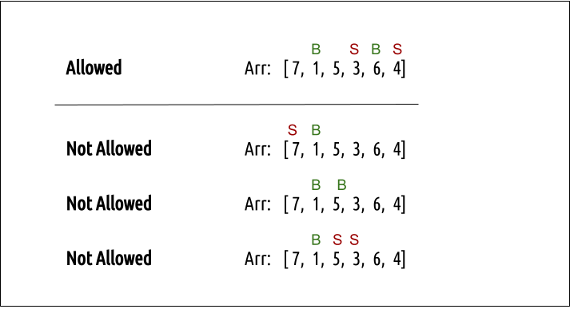

# leetcode 心得7

### string 比较

in C++, can use `==` to compare two `std::string` objects.

`substr` method can be used to extract a substring from a string.
its syntax is `string.substr(start_index, length)`. 
如果 len 超过从 start_index 开始到字符串末尾的长度，substr 将返回从 pos 开始到字符串末尾的子串.

### unordered_map vs unordered_set

`std::unordered_map` 和 `std::unordered_set` 是 C++ 标准库中的两种哈希表容器，它们在功能和用途上有一些显著的区别。

### `std::unordered_map`

`std::unordered_map` 是一个关联容器，用于存储键值对（key-value pairs）。它提供了高效的查找、插入和删除操作，平均时间复杂度为 O(1)。

#### 特点

- **键值对存储**：每个元素是一个键值对，包含一个键和一个值。
- **唯一键**：每个键在容器中是唯一的。
- **哈希表实现**：使用哈希表实现，提供常数时间复杂度的查找、插入和删除操作。

#### 示例代码

```cpp
#include <iostream>
#include <unordered_map>

int main() {
    std::unordered_map<std::string, int> umap;

    // 插入键值对
    umap["apple"] = 1;
    umap["banana"] = 2;
    umap["cherry"] = 3;

    // 访问元素
    std::cout << "apple: " << umap["apple"] << std::endl;

    // 查找元素
    auto it = umap.find("banana");
    if (it != umap.end()) {
        std::cout << "Found banana: " << it->second << std::endl;
    }

    // 遍历元素
    for (const auto& pair : umap) {
        std::cout << pair.first << ": " << pair.second << std::endl;
    }

    return 0;
}
```

### `std::unordered_set`

`std::unordered_set` 是一个关联容器，用于存储唯一的元素。它提供了高效的查找、插入和删除操作，平均时间复杂度为 O(1)。

#### 特点

- **唯一元素**：每个元素在容器中是唯一的。
- **哈希表实现**：使用哈希表实现，提供常数时间复杂度的查找、插入和删除操作。
- **无序存储**：元素的存储顺序不保证。

#### 示例代码

```cpp
#include <iostream>
#include <unordered_set>

int main() {
    std::unordered_set<std::string> uset;

    // 插入元素
    uset.insert("apple");
    uset.insert("banana");
    uset.insert("cherry");

    // 访问元素
    if (uset.find("apple") != uset.end()) {
        std::cout << "Found apple" << std::endl;
    }

    // 遍历元素
    for (const auto& elem : uset) {
        std::cout << elem << std::endl;
    }

    return 0;
}
```

### 区别总结

1. **存储内容**：
   - `std::unordered_map`：存储键值对（key-value pairs），每个键在容器中是唯一的。
   - `std::unordered_set`：存储唯一的元素，每个元素在容器中是唯一的。

2. **访问方式**：
   - `std::unordered_map`：通过键访问对应的值。
   - `std::unordered_set`：通过元素本身进行查找。

3. **用途**：
   - `std::unordered_map`：适用于需要存储键值对并通过键快速查找值的场景。
   - `std::unordered_set`：适用于需要存储唯一元素并快速查找元素的场景。

通过这些示例和解释，你可以更好地理解 `std::unordered_map` 和 `std::unordered_set` 的区别及其应用场景。

### 买卖股票的最佳时机

重点：找到序列中前后两个元素的最大差值。经典题，用两个for循环会超时，所以用一个for循环，用一个变量记录前面的最小值，然后每次更新最大差值。

```cpp
int maxProfit(vector<int>& prices) {
       int pre = prices[0], ans = 0;
       for (int i = 0; i < prices.size(); i++) {
           ans = max(ans, prices[i] - pre);
           pre = min(pre, prices[i]);
       }
       return ans;
    }

```
### 卖股票的最佳时机2

重点：找到序列中所有的上升区间，然后把所有的上升区间的差值加起来。这个题目的关键是找到所有的上升区间。
原因：可以画一个折线图，以及必然遵循 buy -> sell -> buy -> sell -> buy -> sell 的规律。


### word break

动态规划。[word break ans](https://www.geeksforgeeks.org/word-break-problem-dp-32/)

用字典树来存储单词，然后用动态规划来解决问题。

```cpp
bool wordBreak(string s, vector<string>& wordDict) {
        unordered_set<string> dict(wordDict.begin(), wordDict.end());
        vector<bool> dp(s.size() + 1, false);
        dp[0] = true;
        for (int i = 1; i <= s.size(); i++) {
            for (int j = 0; j < i; j++) {
                if (dp[j] && dict.count(s.substr(j, i - j))) {
                    dp[i] = true;
                    break;
                }
            }
        }
        return dp[s.size()];
    }
```
### vector.back() vs vector.pop_back()

`vector.back()` 返回最后一个元素的`引用`,会直接修改最后的元素，`vector.pop_back()` 删除最后一个元素。

### clone graph

```cpp
// A C++ program to Clone an Undirected Graph
#include<bits/stdc++.h>
using namespace std;

struct GraphNode
{
	int val;

	//A neighbour vector which contains addresses to
	//all the neighbours of a GraphNode
	vector<GraphNode*> neighbours;
};

// A function which clones a Graph and
// returns the address to the cloned
// src node
GraphNode *cloneGraph(GraphNode *src)
{
	//A Map to keep track of all the
	//nodes which have already been created
	map<GraphNode*, GraphNode*> m;
	queue<GraphNode*> q;

	// Enqueue src node
	q.push(src);
	GraphNode *node;

	// Make a clone Node
	node = new GraphNode();
	node->val = src->val;

	// Put the clone node into the Map
	m[src] = node;
	while (!q.empty())
	{
		//Get the front node from the queue
		//and then visit all its neighbours
		GraphNode *u = q.front();
		q.pop();
		vector<GraphNode *> v = u->neighbours;
		int n = v.size();
		for (int i = 0; i < n; i++)
		{
			// Check if this node has already been created
			if (m[v[i]] == NULL)
			{
				// If not then create a new Node and
				// put into the HashMap
				node = new GraphNode();
				node->val = v[i]->val;
				m[v[i]] = node;
				q.push(v[i]);
			}

			// add these neighbours to the cloned graph node
			m[u]->neighbours.push_back(m[v[i]]);
		}
	}

	// Return the address of cloned src Node
	return m[src];
}

// Build the desired graph
GraphNode *buildGraph()
{
	/*
		Note : All the edges are Undirected
		Given Graph:
		1--2
		| |
		4--3
	*/
	GraphNode *node1 = new GraphNode();
	node1->val = 1;
	GraphNode *node2 = new GraphNode();
	node2->val = 2;
	GraphNode *node3 = new GraphNode();
	node3->val = 3;
	GraphNode *node4 = new GraphNode();
	node4->val = 4;
	vector<GraphNode *> v;
	v.push_back(node2);
	v.push_back(node4);
	node1->neighbours = v;
	v.clear();
	v.push_back(node1);
	v.push_back(node3);
	node2->neighbours = v;
	v.clear();
	v.push_back(node2);
	v.push_back(node4);
	node3->neighbours = v;
	v.clear();
	v.push_back(node3);
	v.push_back(node1);
	node4->neighbours = v;
	return node1;
}

// A simple bfs traversal of a graph to
// check for proper cloning of the graph
void bfs(GraphNode *src)
{
	map<GraphNode*, bool> visit;
	queue<GraphNode*> q;
	q.push(src);
	visit[src] = true;
	while (!q.empty())
	{
		GraphNode *u = q.front();
		cout << "Value of Node " << u->val << "\n";
		cout << "Address of Node " <<u << "\n";
		q.pop();
		vector<GraphNode *> v = u->neighbours;
		int n = v.size();
		for (int i = 0; i < n; i++)
		{
			if (!visit[v[i]])
			{
				visit[v[i]] = true;
				q.push(v[i]);
			}
		}
	}
	cout << endl;
}

// Driver program to test above function
int main()
{
	GraphNode *src = buildGraph();
	cout << "BFS Traversal before cloning\n";
	bfs(src);
	GraphNode *newsrc = cloneGraph(src);
	cout << "BFS Traversal after cloning\n";
	bfs(newsrc);
	return 0;
}

```
### count vs find in unordered_map

在 C++ 中，`std::unordered_map` 提供了两种常用的方法来检查键是否存在：`count` 和 `find`。这两种方法在功能和用法上有一些区别。

### `count` 方法

`count` 方法用于检查 `std::unordered_map` 中是否包含指定的键。它返回一个整数值，表示键在容器中出现的次数。由于 `std::unordered_map` 中的键是唯一的，因此返回值只能是 0 或 1。

#### 语法

```cpp
size_t count(const Key& key) const;
```

- `key`：要检查的键。
- 返回值：如果键存在，返回 1；否则返回 0。

#### 示例代码

```cpp
#include <iostream>
#include <unordered_map>

int main() {
    std::unordered_map<std::string, int> umap = {{"apple", 1}, {"banana", 2}, {"cherry", 3}};

    // 使用 count 方法检查键是否存在
    if (umap.count("banana") > 0) {
        std::cout << "Found banana" << std::endl;
    } else {
        std::cout << "Did not find banana" << std::endl;
    }

    if (umap.count("grape") > 0) {
        std::cout << "Found grape" << std::endl;
    } else {
        std::cout << "Did not find grape" << std::endl;
    }

    return 0;
}
```

### `find` 方法

`find` 方法用于查找 `std::unordered_map` 中是否包含指定的键。它返回一个迭代器，如果键存在，迭代器指向该键值对；否则，迭代器指向 `unordered_map::end()`。

#### 语法

```cpp
iterator find(const Key& key);
const_iterator find(const Key& key) const;
```

- `key`：要查找的键。
- 返回值：如果键存在，返回指向该键值对的迭代器；否则返回指向 `unordered_map::end()` 的迭代器。

#### 示例代码


```cpp
#include <iostream>
#include <unordered_map>

int main() {
    std::unordered_map<std::string, int> umap = {{"apple", 1}, {"banana", 2}, {"cherry", 3}};

    // 使用 find 方法查找键
    auto it = umap.find("banana");
    if (it != umap.end()) {
        std::cout << "Found banana: " << it->second << std::endl;
    } else {
        std::cout << "Did not find banana" << std::endl;
    }

    it = umap.find("grape");
    if (it != umap.end()) {
        std::cout << "Found grape: " << it->second << std::endl;
    } else {
        std::cout << "Did not find grape" << std::endl;
    }

    return 0;
}
```

### 区别总结

1. **返回值**：
   - `count`：返回键在容器中出现的次数（0 或 1）。
   - `find`：返回指向键值对的迭代器，如果键不存在，返回 `unordered_map::end()`。

2. **用途**：
   - `count`：用于简单地检查键是否存在。
   - `find`：用于查找键并访问其对应的值。

3. **性能**：
   - `count` 和 `find` 的时间复杂度都是 O(1)，因为它们都基于哈希表实现。

### 在 `cloneGraph` 问题中的应用

在 `cloneGraph` 问题的代码中，`unordered_map` 的 `count` 和 `find` 方法用于检查节点是否已经被克隆：

```cpp
GraphNode* cloneGraph(GraphNode* node) {
    if (node == nullptr) {
        return nullptr;
    }

    std::unordered_map<GraphNode*, GraphNode*> m;
    std::queue<GraphNode*> q;
    q.push(node);
    m[node] = new GraphNode(node->val);

    while (!q.empty()) {
        GraphNode* curr = q.front();
        q.pop();

        for (GraphNode* neighbor : curr->neighbors) {
            if (m.find(neighbor) == m.end()) { // 使用 find 方法
                m[neighbor] = new GraphNode(neighbor->val);
                q.push(neighbor);
            }
            m[curr]->neighbors.push_back(m[neighbor]);
        }
    }

    return m[node];
}
```

在这个代码中，`m.find(neighbor) == m.end()` 用于检查 `unordered_map` 中是否已经存在 `neighbor` 节点的克隆。如果不存在，则创建一个新的克隆节点并添加到队列中。

### erase in unordered_map

在 C++ 中，`std::unordered_map` 是一个键值对（key-value pair）容器，其中每个元素由一个唯一的键和一个与之关联的值组成。删除操作通常是基于键进行的，因为键是唯一标识元素的方式。

### 删除键

使用 `std::unordered_map` 的 `erase` 方法可以删除指定键的元素。删除键的操作会同时删除与该键关联的值。

#### 示例代码

以下是一个示例，展示了如何使用 `erase` 方法删除 `std::unordered_map` 中的键：


```cpp
#include <iostream>
#include <unordered_map>

int main() {
    std::unordered_map<std::string, int> umap = {{"apple", 1}, {"banana", 2}, {"cherry", 3}};

    // 删除键 "banana" 及其关联的值
    umap.erase("banana");

    // 输出删除后的 unordered_map
    std::cout << "After erasing 'banana':" << std::endl;
    for (const auto& pair : umap) {
        std::cout << pair.first << ": " << pair.second << std::endl;
    }

    return 0;
}
```
### 解释

1. **定义并初始化 `unordered_map`**：
   ```cpp
   std::unordered_map<std::string, int> umap = {{"apple", 1}, {"banana", 2}, {"cherry", 3}};
   ```

2. **删除键 "banana" 及其关联的值**：
   ```cpp
   umap.erase("banana");
   ```

3. **输出删除后的 `unordered_map`**：
   ```cpp
   std::cout << "After erasing 'banana':" << std::endl;
   for (const auto& pair : umap) {
       std::cout << pair.first << ": " << pair.second << std::endl;
   }
   ```

### 运行结果

运行上述代码后，输出结果如下：

```
After erasing 'banana':
apple: 1
cherry: 3
```

在这个示例中，`umap.erase("banana")` 删除了键 "banana" 及其关联的值 2。

### 删除值

在 `std::unordered_map` 中，删除操作是基于键进行的，不能直接删除值。如果需要删除特定值的元素，可以遍历整个 `unordered_map` 并删除匹配的元素。

#### 示例代码

以下是一个示例，展示了如何删除 `std::unordered_map` 中具有特定值的元素：

```cpp
#include <iostream>
#include <unordered_map>

int main() {
    std::unordered_map<std::string, int> umap = {{"apple", 1}, {"banana", 2}, {"cherry", 3}, {"date", 2}};

    // 删除值为 2 的所有元素
    for (auto it = umap.begin(); it != umap.end(); ) {
        if (it->second == 2) {
            it = umap.erase(it); // 使用返回值更新迭代器
        } else {
            ++it;
        }
    }

    // 输出删除后的 unordered_map
    std::cout << "After erasing elements with value 2:" << std::endl;
    for (const auto& pair : umap) {
        std::cout << pair.first << ": " << pair.second << std::endl;
    }

    return 0;
}
```

### 解释

1. **定义并初始化 `unordered_map`**：
   ```cpp
   std::unordered_map<std::string, int> umap = {{"apple", 1}, {"banana", 2}, {"cherry", 3}, {"date", 2}};
   ```

2. **删除值为 2 的所有元素**：
   ```cpp
   for (auto it = umap.begin(); it != umap.end(); ) {
       if (it->second == 2) {
           it = umap.erase(it); // 使用返回值更新迭代器
       } else {
           ++it;
       }
   }
   ```

3. **输出删除后的 `unordered_map`**：
   ```cpp
   std::cout << "After erasing elements with value 2:" << std::endl;
   for (const auto& pair : umap) {
       std::cout << pair.first << ": " << pair.second << std::endl;
   }
   ```

### 运行结果

运行上述代码后，输出结果如下：

```
After erasing elements with value 2:
apple: 1
cherry: 3
```

在这个示例中，遍历 `unordered_map` 并删除所有值为 2 的元素。

### randomly generate number in C++

在 C++ 中，使用 `rand()` 函数生成随机数，并通过取模运算 (`%`) 来生成一个范围在 `[0, nums.size() - 1]` 之间的随机索引。这种方法可以用于从一个向量或数组中随机选择一个元素。

### 示例代码

以下是一个示例，展示了如何使用 `rand()` 函数生成一个随机索引，并从向量中随机选择一个元素：

```cpp
#include <iostream>
#include <vector>
#include <cstdlib> // 包含 rand() 和 srand()
#include <ctime>   // 包含 time()

int main() {
    // 初始化随机数生成器
    std::srand(std::time(0));

    std::vector<int> nums = {10, 20, 30, 40, 50};

    // 生成一个随机索引
    int randomIndex = std::rand() % nums.size();

    // 输出随机索引和对应的元素
    std::cout << "Random index: " << randomIndex << std::endl;
    std::cout << "Element at random index: " << nums[randomIndex] << std::endl;

    return 0;
}
```

### 解释

1. **初始化随机数生成器**：
   ```cpp
   std::srand(std::time(0));
   ```
   - 使用 `std::srand` 函数初始化随机数生成器，并传入当前时间作为种子，以确保每次运行程序时生成不同的随机数。

2. **定义并初始化向量**：
   ```cpp
   std::vector<int> nums = {10, 20, 30, 40, 50};
   ```

3. **生成一个随机索引**：
   ```cpp
   int randomIndex = std::rand() % nums.size();
   ```
   - 使用 `std::rand()` 函数生成一个随机数，并通过取模运算 (`% nums.size()`) 将其限制在 `[0, nums.size() - 1]` 范围内。

4. **输出随机索引和对应的元素**：
   ```cpp
   std::cout << "Random index: " << randomIndex << std::endl;
   std::cout << "Element at random index: " << nums[randomIndex] << std::endl;
   ```

### 运行结果

运行上述代码后，输出结果类似如下（每次运行结果可能不同）：

```
Random index: 2
Element at random index: 30
```

### 注意事项

- `std::rand()` 函数生成的随机数是伪随机数，使用相同的种子会生成相同的随机数序列。为了确保每次运行程序时生成不同的随机数序列，通常使用 `std::srand(std::time(0))` 初始化随机数生成器。
- `std::rand()` 函数生成的随机数范围是 `[0, RAND_MAX]`，其中 `RAND_MAX` 是一个常量，通常定义为 32767。通过取模运算可以将其限制在所需的范围内。

### 使用 C++11 的随机数库

C++11 引入了更强大的随机数库，可以生成更高质量的随机数。以下是使用 C++11 随机数库生成随机索引的示例：

```cpp
#include <iostream>
#include <vector>
#include <random> // 包含随机数库

int main() {
    std::vector<int> nums = {10, 20, 30, 40, 50};

    // 初始化随机数生成器
    std::random_device rd;
    std::mt19937 gen(rd());
    std::uniform_int_distribution<> dis(0, nums.size() - 1);

    // 生成一个随机索引
    int randomIndex = dis(gen);

    // 输出随机索引和对应的元素
    std::cout << "Random index: " << randomIndex << std::endl;
    std::cout << "Element at random index: " << nums[randomIndex] << std::endl;

    return 0;
}
```

在这个示例中，使用 `std::random_device` 和 `std::mt19937` 生成高质量的随机数，并使用 `std::uniform_int_distribution` 将随机数限制在 `[0, nums.size() - 1]` 范围内。通过这种方式，可以生成更高质量的随机数。


