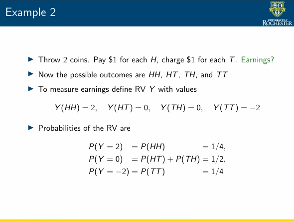

# Math thinks

### set vs outcome(集合中的元素) vs event(is also a set)
目前正在学习随机过程，sample space `S` is  a set, sigma-algebra is a collection of subsets of the sample space, probability measure is a function that assigns probabilities to events in the sigma-algebra.

### RV
RV X(s) is a function that assigns a value to an outcome s ∈ S⇒ Think of RVs as measurements associated with an experiment

### markov inequality

