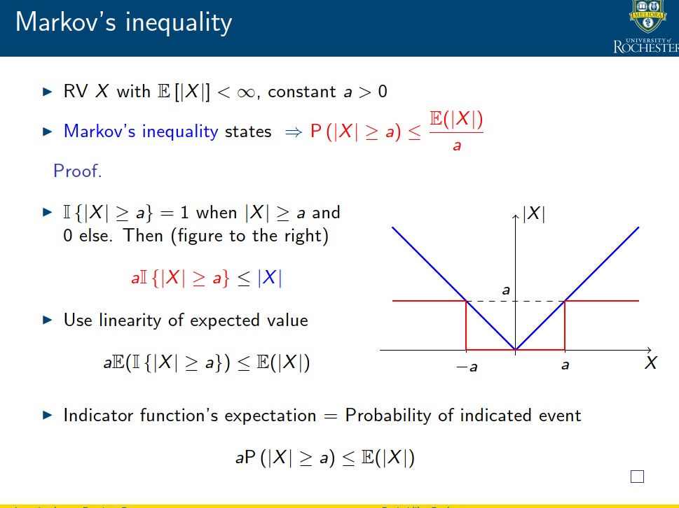

# Math thinks(you should refer to stoiastic process files)

### set vs outcome(集合中的元素) vs event(is also a set)
目前正在学习随机过程，sample space `S` is  a set, sigma-algebra is a collection of subsets of the sample space, probability measure is a function that assigns probabilities to events in the sigma-algebra.

### RV
RV X(s) is a function that assigns a value to an outcome s ∈ S⇒ Think of RVs as measurements associated with an experiment

### markov inequality

### random process definition

A random process is a collection (or ensemble) of RVs{X(s, t)}that are functions of a real variable, namely timet where s∈S (sample space) and t∈T (parameter set or index set).

The set of possible values of any individual member of the random process called state space. Any individual member itself is called a sample function or a realisation of the process.

### almost sure convergence vs convergence in probability(see lecture 4.pdf)

- Almost sure convergence: A sequence of RVs {Xn} converges almost surely to a RV X if P({s: limn→∞Xn(s) = X(s)}) = 1

- Convergence in probability: A sequence of RVs {Xn} converges in probability to a RV X if for any ε > 0, limn→∞P(|Xn − X| > ε) = 0

### law of total probability is important in probability theory

this law is playing a key role in the derivation of the markov's chain.

### trasient state vs recurrent state

fi 是指从状态i开始，在有限时间内回到状态i（第一次）的概率，如果fi=1，那么状态i是recurrent state，否则是transient state。
要与常规的定义(无穷为recurrent)区分开。

